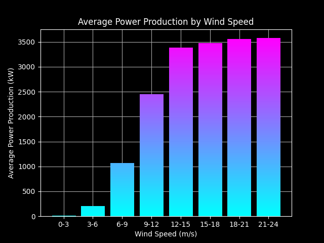

# Analysis of Wind Turbine Performance Data

I found some common questions about wind turbines and I will answer them in this project. :)
After that I compare 6 different Machine Learning Models and select the best one to a predict REST API.

Used imports:
    import calendar
    from datetime import timedelta
    from colorama import Fore
    import joblib
    from matplotlib import dates
    from matplotlib.widgets import Slider
    import pandas as pd
    import matplotlib as mpl
    import numpy as np
    import matplotlib.pyplot as plt
    import seaborn as sns
    from sklearn.linear_model import LinearRegression

1. **What is the quality of the database?**
    - First I checked how much missing data there is in the .csv. No one.
    - After, I used detect_missing_data(data) function to determine the number of missing data.
        Path: Results/Missing_hours.png

        

    Here we can see, that there are a few missing intervals, but not too many. it only exceeds 10% in January and November. So, I think I can work with this data.
    -Need to optimize the dataframe, so I fix it with the optimize_dateformat(data) function.

2. **Is there any difference between the periods for average power production ?**
    - used function: most_productive_periods(data, period = 'month')
        Path: Results/Most_effective_months.png

        

    - This plot show to us many information. Avg. wind speed, Avg. production and the best ratio. 
    - Also we have this plot with the hours of the day:
        Path: Results/Most_effective_hours.png

        

    - So, the most productive periods(,above the avg.) are: 1.-3. and the 8.-11. months, and 15:00-06:00.
    - The best ratio: 17:00-23:00 [If we had more data (such as temperature, humidity, etc.) we could draw more conclusions about efficiency.]
    - If we want to carry out pre-planned maintenance, the best time is: I Jun., around 10 oclock

3. **Is there any correlation between the wind speed, wind direction and power production?**
    - After we print the correlations
        wind speed-power: 0.9127742911275556
        wind direction-power: -0.0627017262406927
        wind speed-wind direction-0.0771877325070333
    As expected, there is a strong correlation between the wind speed and the pruduction (if higher the wind strength, then higher the energy produced too), in the other two comparisons, a negative correlation is visible, but not significant.
    - When we take a look on the next plot, we can detect, that most productive direction is between 30°-90° (more than the half of the productivity).
        Path: Results/Total_Active_Power_by_Wind_Direction.png

        

    - Efficiency ratios:
        180.0                       201.804142
        210.0                       185.451150
        60.0                        184.327066
        30.0                        178.858971
        150.0                       170.894591
        0.0                         139.857633
        240.0                       107.838955
        330.0                       101.040597
        120.0                        88.393046
        300.0                        84.732431
        270.0                        84.129620
        90.0                         51.022850

    - It's worst in the 90 degree range.
        Path: Results/Efficiency_by_Wind_Direction.png

        

4. **What is the average power production level for different wind speeds?**
    - Plot:
        Path: Results/Average_Power_Production_by_Wind_Speed.png

        

5. **Does the manufacturer's theoritical power production curve fit well with the real production?**
    - used function: plot_theoretical_vs_real_power(data)

    

    No. :)

**Compare few ML models, and select the best one. **
    - Predict.py
    - After I compare 6 models in 'train_model_pandas' function, I check again, with cross-validation technique in the  'train_model_pandas_with_crossvalidate' function
    - Output:
        Mean squared error of RandomForest: 76884.55975111797
        Mean squared error of LinearRegression: 289326.6532717247
        Mean squared error of DecisionTreeRegressor: 142258.91625064664
        Mean squared error of GradientBoostingRegressor: 106041.3421226055
        Mean squared error of HistGradientBoostingRegressor: 70740.3350831403
        Mean squared error of Neural Network: 185153.64670135773

        With cross-validation:
        Random Forest
        Mean squared error: 71691.81319579162
        Standard deviation: 7826.644507782854
        MAE: 36.50
        R-squared score: 0.99

        Linear Regression
        Mean squared error: 282042.98503302305
        Standard deviation: 13253.377040272951
        MAE: 387.22
        R-squared score: 0.84

        Decision Tree
        Mean squared error: 132234.21716849785
        Standard deviation: 14918.556410607904
        MAE: 0.00
        R-squared score: 1.00

        Gradient Boosting Regressor
        Mean squared error: 99818.09909585668
        Standard deviation: 9638.413549469624
        MAE: 129.86
        R-squared score: 0.94

        Hist Gradient Boosting Regressor
        Mean squared error: 66786.26428048327
        Standard deviation: 6129.332570860477
        MAE: 92.85
        R-squared score: 0.97

        On the test set:
        Mean squared error of HistGradientBoostingRegressor : 69757.32405694987
        MAE of HistGradientBoostingRegressor on testing data: 105.21
        R-squared score of HistGradientBoostingRegressor on testing data: 0.96

    - About the evaluation metrics:
        The mean squared error (MSE) and mean absolute error (MAE) are two common evaluation metrics used to assess the performance of regression models. The MSE measures the average squared difference between the predicted values and the actual values, while the MAE measures the average absolute difference between the predicted values and the actual values. The lower the values of these metrics, the better the performance of the model.

        The R-squared (R2) score is another metric used to evaluate the performance of regression models. It measures the proportion of the variance in the dependent variable that is explained by the independent variables. The R2 score ranges from 0 to 1, with 1 indicating a perfect fit between the predicted and actual values. A higher R2 score indicates a better fit of the model to the data.

    Although the Decision Tree model has a lower MSE, it has an MAE of 0.00, which indicates that it perfectly predicts the target variable for the training data. However, this does not necessarily mean that it will perform well on new, unseen data. In contrast, the HistGradientBoostingRegressor model has a higher MAE (105.21), indicating that its predictions on the testing data may be slightly less accurate than the Decision Tree model's predictions on the training data. However, it still has a relatively low MSE and a high R-squared score (0.96), suggesting that it is a more reliable model for making predictions on new, unseen data.

    Therefore, when comparing models, it is important to consider both their performance on the training data and their ability to generalize to new, unseen data. In this case, the HistGradientBoostingRegressor model outperforms the Decision Tree model in terms of its ability to generalize to new data, despite having a slightly higher MAE on the testing data.

    **It seems like the HistGradientBoostingRegressor model performed the best based on the mean squared error on the training set, and it also had the lowest mean squared error on the test set, which suggests that it may generalize well to new data.**

About the functions:

optimize_dateformat(data): This function takes a pandas DataFrame and optimizes the date format by converting the "Date/Time" column to a datetime format, dropping the original column, and setting the new "Date" column as the DataFrame's index. The optimized DataFrame is then returned.

set_dark_bg(): This function sets the matplotlib style to a dark background and the seaborn color palette to 'bright'.

clearPlts(): This function clears all matplotlib plots and closes all figures.

most_productive_periods(data, period = 'month'): This function takes a pandas DataFrame and a string indicating the period to group the data by ('hour' or 'month'). It then calculates the mean "LV ActivePower (kW)" and "Wind Speed (m/s)" for each period, and calculates the ratio of the two. The function then creates a plot showing the average power and wind speed for each period and the highest ratio. If the period is 'hour', the x-axis shows the hour of the day, and if the period is 'month', the x-axis shows the month of the year.

detect_missing_data(data): This function takes a pandas DataFrame and checks for missing data by comparing the expected periods (10 minutes intervals between the earliest and latest dates in the DataFrame) with the actual periods in the DataFrame. It then counts the number of missing periods for each month and creates a bar plot showing the missing hours for each month.

corr_between_windspeed_activepower_winddirection(data): This function takes a pandas DataFrame and calculates the Pearson correlation coefficient between "Wind Speed (m/s)" and "LV ActivePower (kW)" and between "Wind Direction (°)" and "LV ActivePower (kW)". It then rounds the wind direction values to the nearest 30 degrees, groups the data by wind direction, and calculates the total active power for each wind direction. Finally, it creates a pie chart showing the total active power for each wind direction.